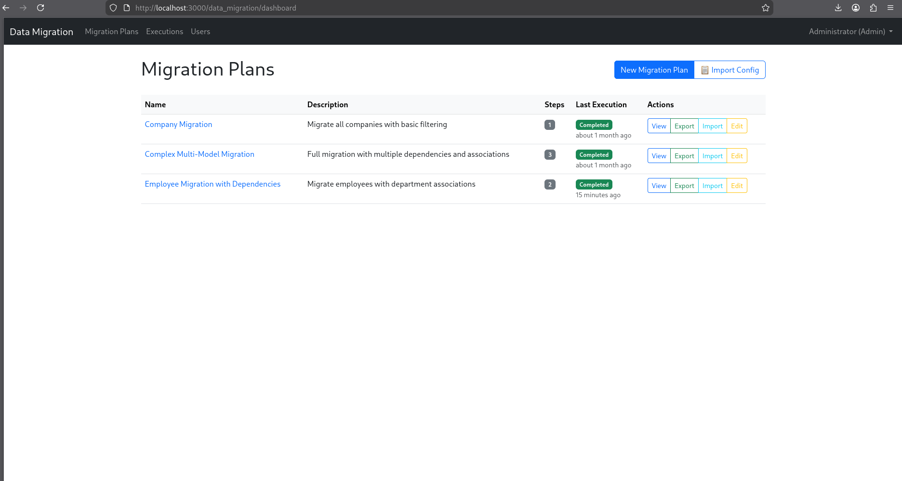
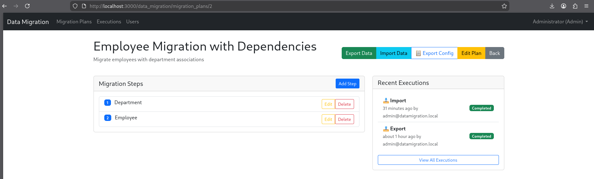
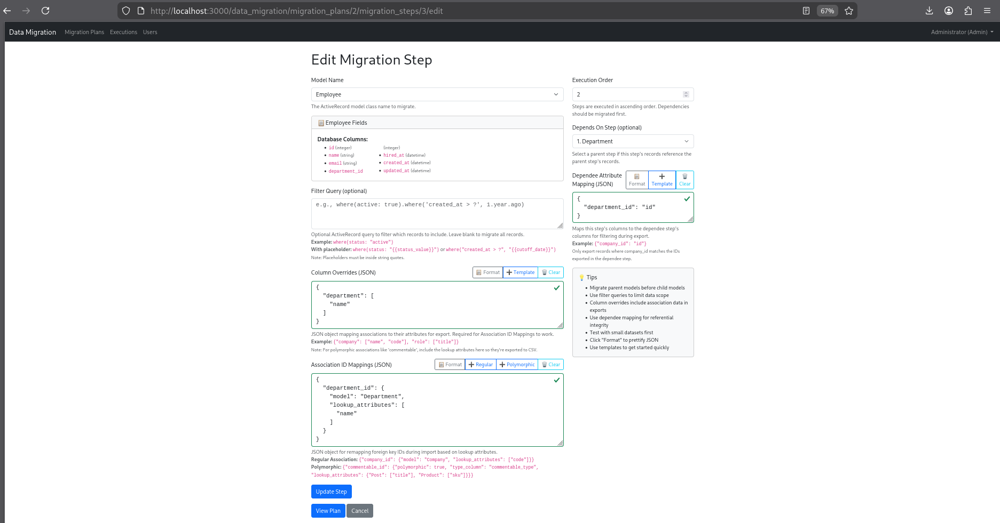
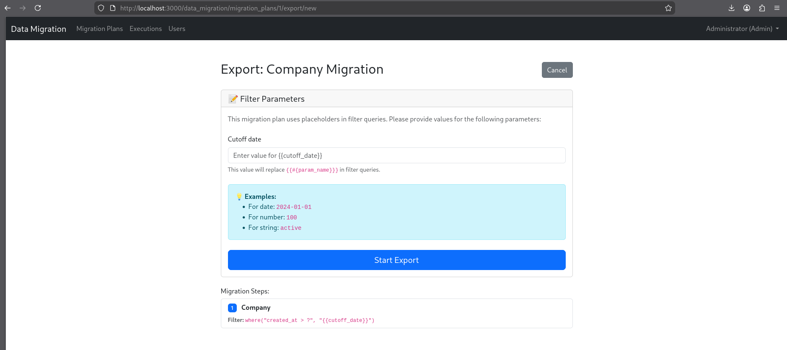
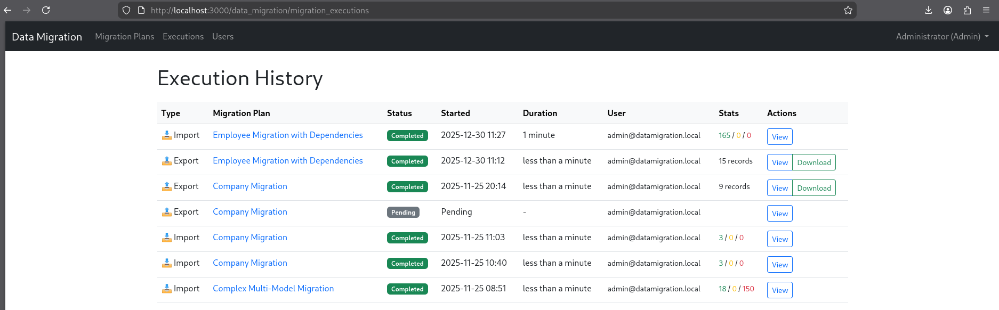
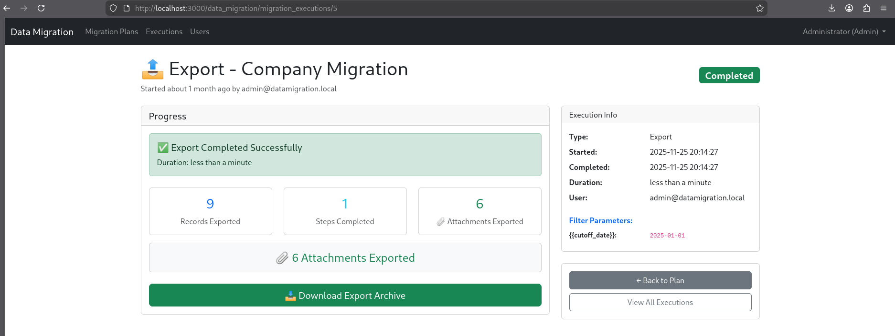
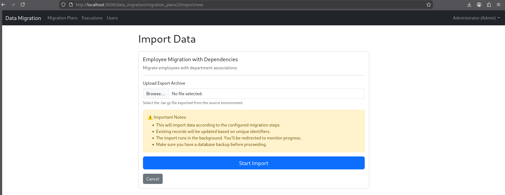
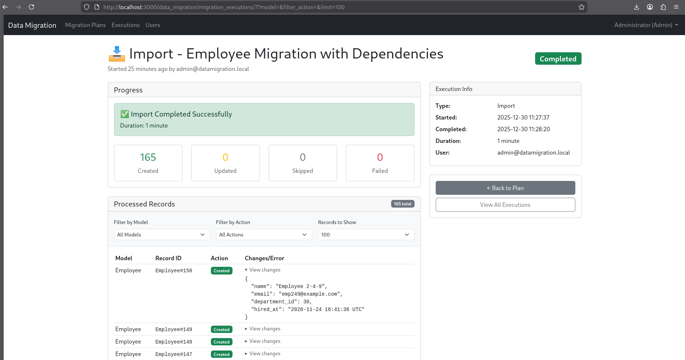

# Quick Start Guide - Rails Engine

Get the Data Migration engine installed and running in your Rails app in 5 minutes!

## Prerequisites

- Existing Rails application (Rails 7.0+)
- Ruby 3.0+
- Redis installed and running

## Installation (4 Steps)

### 1. Add to Gemfile

```ruby
gem 'data_migration_for_rails', '~> 0.1.1'
```

```bash
bundle install
```

### 2. Install Migrations

```bash
bin/rails data_migration:install:migrations
bin/rails db:migrate
```

### 3. Seed Initial Admin User

```bash
bin/rails db:seed
```

This creates an admin user:
- **Email:** admin@datamigration.local
- **Password:** password

### 4. Mount Engine

In `config/routes.rb`:

```ruby
Rails.application.routes.draw do
  mount DataMigration::Engine, at: "/data_migration"
end
```

---

## Start Services

Ensure Redis and Sidekiq are running:

**Terminal 1 - Redis:**
```bash
redis-server
```

**Terminal 2 - Sidekiq:**
```bash
bundle exec sidekiq
```

**Terminal 3 - Rails Server:**
```bash
bin/rails server
```

---

## Access the Engine

Open browser: **http://localhost:3000/data_migration**

Login with:
- **Email:** admin@datamigration.local
- **Password:** password

**Change the password immediately** via the user dropdown menu > Change Password.



---

## First Migration

### Step 1: Create a Migration Plan

1. Click **"New Migration Plan"**
2. Name: `Test Migration`
3. Description: `Testing export/import`
4. Click **"Create Migration Plan"**



### Step 2: Add a Migration Step

1. Click **"Add Migration Step"**
2. Configure:
   - **Model Name**: Select from dropdown (shows model fields and attachments)
   - **Sequence**: `1`
   - **Filter Query** (optional): `limit(10)` (to test with just 10 records)
   - **Attachment Export Mode** (optional): Choose `Ignore`, `URL`, or `Raw Data` for Active Storage attachments
3. Click **"Create Migration Step"**



### Step 3: Export Data

1. Click **"Export"** button on the migration plan page
2. Wait for Sidekiq to process the job (check Terminal 2)
3. Execution page will show progress
4. When complete, click **"Download Export Archive"**







### Step 4: Import Data (Optional Test in a separate instance)

1. Click **"Import"** button
2. Upload the `.tar.gz` file you just downloaded
3. Click **"Start Import"**
4. Monitor progress on the execution page





---

## Advanced Configuration

### Export with Association Data

Edit your migration step and add Column Overrides:

```json
{
  "company": ["name", "code"],
  "manager": ["email"]
}
```

This exports `company.name`, `company.code`, and `manager.email` alongside the main model data.

### Remap Foreign Keys on Import

Add Association Overrides:

```json
{
  "company_id": {
    "model": "Company",
    "lookup_attributes": ["code"]
  }
}
```

This remaps the `company_id` foreign key by finding the Company in the target database using the `code` attribute instead of the source ID.

### Handle Active Storage Attachments

Set the **Attachment Export Mode** when models have `has_one_attached` or `has_many_attached`:
- **Ignore** - Skip attachments entirely
- **URL** - Export attachment URLs (best for cloud storage like S3)
- **Raw Data** - Export actual files in archive (best for local storage)

---

## User Management

The engine has independent authentication with three roles:

| Role | Permissions |
|------|-------------|
| **Admin** | Full access: manage plans, steps, users, and execute migrations |
| **Operator** | Can execute exports/imports only |
| **Viewer** | Read-only access to plans and executions |

**Admin users** can create additional users via the "Users" menu:
1. Click "Users" in the navbar
2. Click "New User"
3. Fill in name, email, password, and role
4. Click "Create User"

**All users** can change their own passwords via the user dropdown menu > Change Password.

---

## Common Issues

**"Model not found" error**
- Ensure the model name exactly matches your ActiveRecord model class name
- Example: `Company` not `company` or `Companies`

**"Redis connection refused"**
```bash
redis-server
```

**"Sidekiq not processing jobs"**
```bash
bundle exec sidekiq
```

**Routes not working**
- Check that the engine is mounted in `config/routes.rb`
- Verify you're accessing `/data_migration` (or your custom mount path)

**Unauthorized access**
- Ensure your user has `role: :admin`
- Check Pundit policies are not blocking access

---

## Next Steps

- Read [README.md](README.md) for detailed documentation
- Read [INSTALLATION.md](INSTALLATION.md) for installation details
- Configure complex migrations with filters and associations
- Set up background job monitoring

---

**Need Help?** Check the Troubleshooting section in README.md
